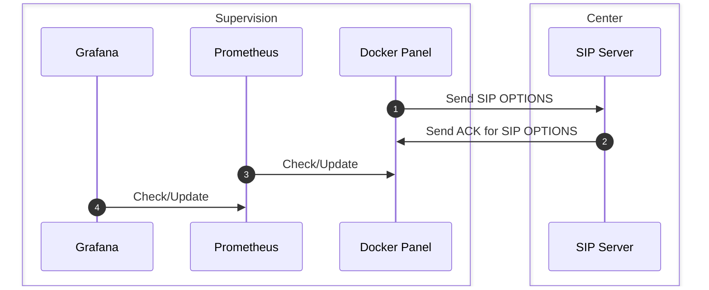
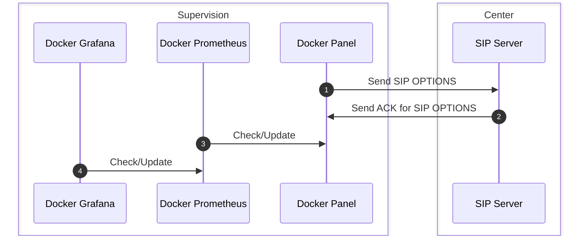

# Docker Ping with protocol SIP in UDP for Prometheus/Grafana

For more information on Grafana : (https://grafana.com/)

For more information on Prometheus : (https://prometheus.io/)

For more information on Docker : (https://www.docker.com/)

SIP Server : 
  - Asterisk (https://www.asterisk.org/)
  - Ejabberd (https://www.process-one.net/en/ejabberd/)
  - ...

The tools works only on UDP for the moment, the goal it's to test SIP Server with PING SIP and create graph on GRAFANA.

**The frequency of Ping = the frequency of request from Prometheus.**


## Architecture



It's possible to use Grafana & Prometheus as Docker container :




## Configuration 

### Configuration for Docker Panel

In file docker-compose.yml

- PROMETHEUS\_PORT : Port for Prometheus .
  - By default : 9069/tcp

- DOMAIN : Domain of SIP Server **(very important)**
  - By default : 127.0.0.1

- USERID : User ID of PING
  - By default : ping

- PORT : Port of SIP Server
  - By default : 5100 **(normally it's 5060 by default on SIP)**
- INTERFACE : Interface of local network
  - By default : eth0


In file Panel/Dockerfile

Put on EXPOSE the same value as PROMETHEUS\_PORT

### Command for Docker

```
$ docker-compose build

$ docker-compose up -d

$ docker ps
CONTAINER ID   IMAGE        COMMAND          CREATED         STATUS         PORTS                                       NAMES
e0f7c7d7c0b7   panel:last   "/sbin/xpanel"   8 seconds ago   Up 7 seconds   0.0.0.0:9069->9069/tcp, :::9069->9069/tcp   simulator-docker-prometheus-pingsip_panel_1
```

#### How to test with telnet ?

##### Version 1 

```
$ telnet 127.0.0.1 9069
Trying 127.0.0.1...
Connected to 127.0.0.1.
Escape character is '^]'.
HTTP/1.1 200 OK

# HELP pingsip_duration PINGSIP duration 
# TYPE pingsip_duration counter
pingsip_duration{localip="165.195.194.206",publicip="XXXXXX",localport="36180",publicport="XXXX",domain="XXXXXXXX"} 0.04775 

Connection closed by foreign host.
```

##### Version 2

```
$ telnet 127.0.0.1 9069
Trying 127.0.0.1...
Connected to 127.0.0.1.
Escape character is '^]'.

HTTP/1.1 200 OK

# HELP pingsip_status PINGSIP status 
# TYPE pingsip_status counter
pingsip_status{localip="165.195.194.206",publicip="XXXXXX",localport="49102",publicport="XXXX",domain="XXXX",user="ping"} 0 
# HELP pingsip_success PINGSIP sucess 
# TYPE pingsip_success counter
pingsip_success{localip="165.195.194.206",publicip="XXXXX",localport="49102",publicport="XXXXX",domain="XXXXXX",user="ping"} 2 
# HELP pingsip_failed PINGSIP failed 
# TYPE pingsip_failed counter
pingsip_failed{localip="165.195.194.206",publicip="XXXXX",localport="49102",publicport="XXXXX",domain="XXXXXXX",user="ping"} 0 
# HELP pingsip_duration PINGSIP duration 
# TYPE pingsip_duration gauge
pingsip_duration{localip="165.195.194.206",publicip="XXXXX",localport="49102",publicport="XXXXX",domain="XXXXXXX"} 0.04581 

Connection closed by foreign host

```

##### Version 3

```
$ telnet 127.0.0.1 9069
Trying 127.0.0.1...
Connected to 127.0.0.1.
Escape character is '^]'.

HTTP/1.1 200 OK

# HELP pingsip_status PINGSIP status 
# TYPE pingsip_status counter
pingsip_status{localip="165.195.194.206",publicip="XXXXX",localport="54701",publicport="12986",domain="XXXXX",user="ping"} 0 
# HELP pingsip_success PINGSIP sucess 
# TYPE pingsip_success counter
pingsip_success{localip="165.195.194.206",publicip="XXXXX",localport="54701",publicport="12986",domain="XXXX",user="ping"} 1 
# HELP pingsip_failed PINGSIP failed 
# TYPE pingsip_failed counter
pingsip_failed{localip="165.195.194.206",publicip="XXXX",localport="54701",publicport="12986",domain="XXXX",user="ping"} 1 
# HELP pingsip_duration PINGSIP duration 
# TYPE pingsip_duration gauge
pingsip_duration{domain="XXXX"} 0.04541 
# HELP pingsip_wait_prometheus PINGSIP wait prometheus 
# TYPE pingsip_wait_prometheus gauge
pingsip_wait_prometheus{domain="XXXX"} 8.84670 

Connection closed by foreign host

```

### Configuration for Prometheus

### Configuration for Grafana


# Author

**ARIAS Frederic** <br />
*EMEA Customer Success Engineer (CSE)* <br />
*Application System Engineering – CX Partner Dev API*  <br />
*Principal Software Engineering Manager of PE1800IP* <br />
*Linux pragmatist, not an evangelist* <br />
<br />
RESIDEO  | Pro Install Security <br />
1198, Avenue du Docteur Maurice Donat - BP 1219 <br />
06254 MOUGINS cedex, FRANCE <br />
[GitHub](https://github.com/ARIASFREDERIC) [LinkedIn](https://fr.linkedin.com/in/ariasfrederic/fr) <br />

